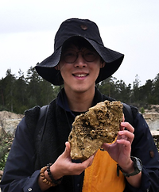
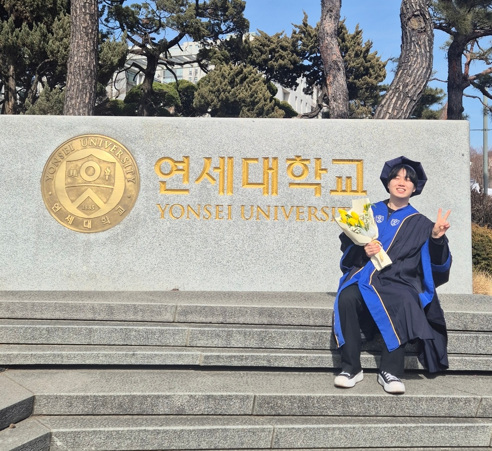

## 🎓 연구 교수 (Research Prof.)

### 1. 조세현 (Cho, Se Hyun)

::::: {layout-ncol="2"}
{width="169mm"}

-   **Research Area:** Sedimentology, Stratigraphy
-   **Email:** whtpgus307\@korea.ac.kr
-   **Education**
    -   Ph.D., Geology, Dept. of Earth and Environmental Science, Korea Univ.
    -   M.S., Geology, Dept. of Earth and Environmental Science, Korea Univ.
    -   B.S., Geology, Dept. of Earth and Environmental Science, Korea Univ.

::: {style="margin-top: 5px; line-height: 1.8;"}
<a href="mailto:whtpgus307@korea.ac.kr" style="color: black; text-decoration: none;">  Email </a> 

<a href="https://www.researchgate.net/profile/Cho-Se-Hyun-2" style="color: black; text-decoration: none;">  Research Gate </a> 

<a href="https://ees.korea.ac.kr/ees/info/study.do?mode=view&articleNo=786674" style="color: black; text-decoration: none;">  School Website </a>
:::

:::::

 

### 2. 오영주 (Oh, Yeong Ju)

::::: {layout-ncol="2"}
{width="169mm"}

-   **Research Area:** Paleontology, Paleoecology
-   **Email:** ohyeongju\@korea.ac.kr
-   **Education**
    -   Ph.D.,
    -   M.S.,
    -   B.S.,
-   (現)한국고생물학회 총무

::: {style="margin-top: 5px; line-height: 1.8;"}
<a href="mailto:ohyeongju@korea.ac.kr" style="color: black; text-decoration: none;">  Email </a> 

<a href="https://www.researchgate.net/profile/Yeongju-Oh" style="color: black; text-decoration: none;">  Research Gate </a> 

<a href="https://ees.korea.ac.kr/ees/info/study.do?mode=view&articleNo=786677" style="color: black; text-decoration: none;">  School Website </a>
:::

:::::

   

------------------------------------------------------------------------

## 🎓 박사 후 연구원 (Ph.D. Researchers)

### 1. 전주완 (Jeon, Ju Wan)

::::: {layout-ncol="2"}
{width="169mm"}

-   **Research Area:** Paleontology, Paleoecology, Stromatoporoid
-   **Email:** juwanjeon\@korea.ac.kr
-   **Education**
    -   Ph.D.,
    -   M.S.,
    -   B.S.,

::: {style="margin-top: 5px; line-height: 1.8;"}
<a href="mailto:juwanjeon@korea.ac.kr" style="color: black; text-decoration: none;">  Email </a> 

<a href="https://www.researchgate.net/profile/Juwan-Jeon" style="color: black; text-decoration: none;">  Research Gate </a> 

<a href="https://ees.korea.ac.kr/ees/info/study.do?mode=view&articleNo=786679" style="color: black; text-decoration: none;">  School Website </a>
:::

:::::

   

------------------------------------------------------------------------

## 🎓 석사과정생 (M.S. Student)

### 1. 나강채 (Na, Kang Chea)

:::: {layout-ncol="2"}
{width="100%"}

-   **Interest:** Sedimentology, Petrology, Carbonate Rocks
-   **Email:** @korea.ac.kr
-   **Education**
    -   B.S. Dept. of Earth System Sciences, Yonsei Univ.(2020.03\~2026.02)
-   **CV**
    -   Undergraduate Researcher, Morphology and Quantitaitve Stratigraphy Group, Yonsei Univ. (2024.07\~2024.11)
    -   Undergraduate Researcher, Sedimentary Petrology Lab, Korea Univ. (2025.07\~2026.02)
    -   M.S. student, Geology, Dept. of Earth and Environmental Science, Korea Univ. (2026.03\~ )

::::

   

------------------------------------------------------------------------

## 🎓 학부연구생 (Undergraduate Researchers)

### 1. 박해인 (Park, Hae In)

:::: {layout-ncol="3"}
{width="100%"}

-   **Interest:** Sedimentology, Petrology, Carbonate Rocks
-   **Email:** ysodad\@korea.ac.kr
-   **CV**
    -   Undergraduate Researcher, Sedimentary Petrology Lab, Korea Univ. (2025.01\~ )

::::

### 2. 권혁규 (Kwon, Hyeok Kyu)

:::: {layout-ncol="3"}

-   **Interest:** Sedimentology, Petrology, Carbonate Rocks
-   **Email:** ijjang123\@korea.ac.kr
-   **CV**
    -   Undergraduate Researcher, Sedimentary Petrology Lab, Korea Univ. (2025.08\~ )

::::

   

------------------------------------------------------------------------

## 💐 졸업생 (Alumni)

-   **2025** \| 주태호 (POSCO International)
-   **2024** \| 조세현 (KOREA UNI.)
-   **2022** \| 정다영 (SK E&S)
-   **2020** \| 함성훈 (POSCO International)
